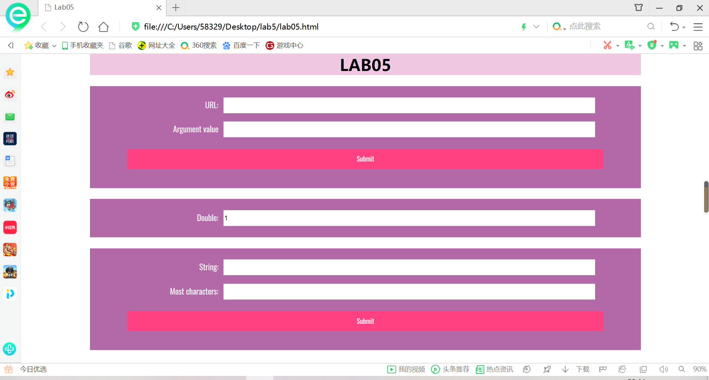

# Lab5设计文档

## 截图

## 第一题
url.value.split("&")用分开，分成好几个部分，变成数组。 
url_useful[i].split("=");将？？？？=？？？分成？？？？ ，？？？。 
然后开始找name，如有就显示其name后面的字符串。 
## 第二题
一开始值为1，然后用new Date()建立新的时间，获取second，每五秒让其值翻倍。
## 第三题
分析字符串，如果找到重复最多的就显示出来
